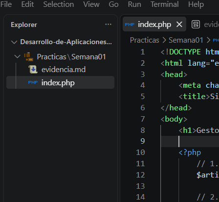
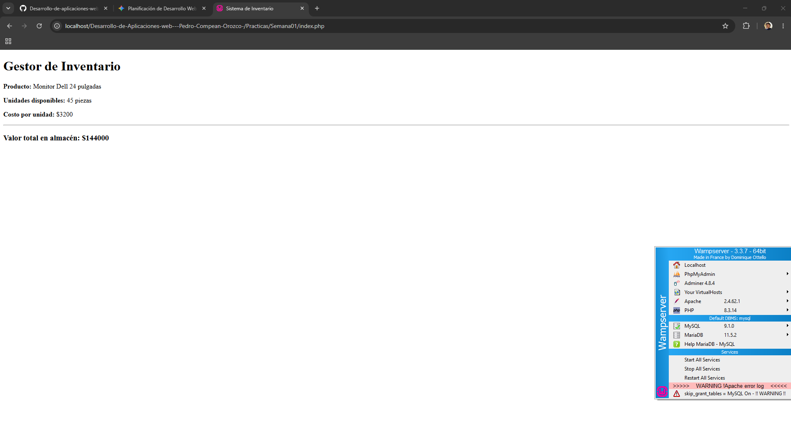
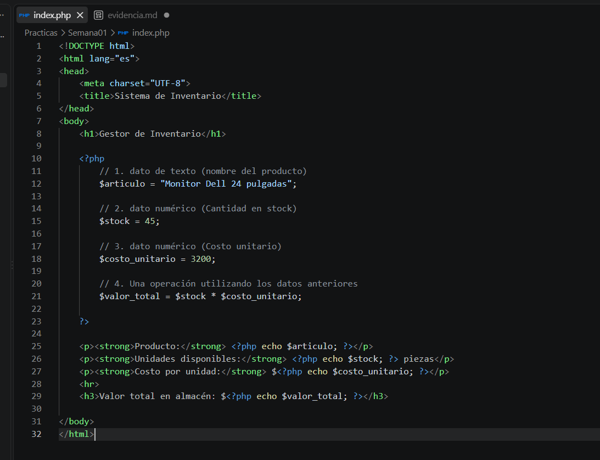
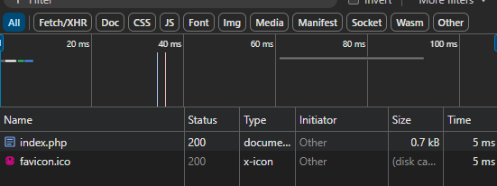
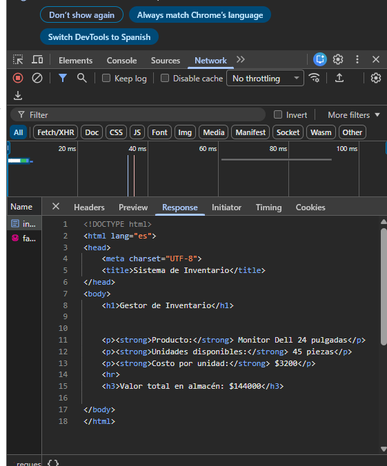
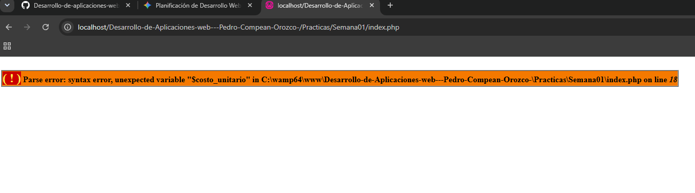

# 🌐 Semana 01 - Primera página web con PHP

---

## 🎯 Objetivo
El objetivo de esta práctica es comprender los fundamentos de una aplicación web, diferenciando entre el cliente y el servidor, y creando una primera versión funcional de nuestro proyecto integrador (Sistema de Inventario) usando PHP y HTML.

---

## 💻 Aplicación web
Una aplicación web es un sistema al que los usuarios acceden a través de un navegador conectado a internet o a una red local. 
> Se compone de una parte visual (frontend) que ve el usuario, y una lógica detrás (backend) que procesa la información en el servidor.

## 🤝 Cliente y servidor
- **👤 Cliente:** Es el navegador web (como Chrome, Edge o Firefox) que utilizamos para pedirle a internet ver una página.
- **🖥️ Servidor:** Es la computadora o programa que guarda los archivos de la página web, recibe las peticiones del cliente, ejecuta el código necesario y le devuelve una respuesta para que el cliente la muestre.

## 📡 HTTP
HTTP es el protocolo o conjunto de reglas que permite que el cliente y el servidor se comuniquen. Funciona como un sistema de mensajes basado en **peticiones** (el navegador pide algo) y **respuestas** (el servidor envía el resultado).

## 🐘 PHP
PHP es un lenguaje de programación diseñado para el desarrollo web. Se ejecuta del lado del **servidor**, lo que significa que procesa las reglas matemáticas, variables o conexiones antes de enviar la página al usuario. El navegador nunca llega a ver el código de PHP.

## 📄 HTML
HTML es el lenguaje de marcado que estructura visualmente la página web. Es lo que el navegador sabe leer e interpretar para acomodar textos, títulos, imágenes y párrafos en la pantalla.

## 🏠 localhost
`localhost` significa literalmente "esta computadora". En desarrollo web, lo usamos para hacer pruebas locales ejecutando un servidor en nuestra propia máquina, sin necesidad de comprar un alojamiento en internet.

---

## 📦 Variables y tipos de datos
Una variable es un espacio en la memoria donde guardamos datos que nuestro programa va a utilizar o modificar. En esta práctica utilicé:
- **Cadenas de texto (String):** Para guardar el nombre de mi producto (`$articulo = "Monitor Dell 24 pulgadas"`).
- **Números (Integer):** Para guardar cantidades exactas como el stock y el precio (`$stock = 45`, `$costo_unitario = 3200`).

## ➕ Operadores
Utilicé el **operador de asignación (`=`)** para darle valor a las variables y el **operador aritmético de multiplicación (`*`)** para calcular el valor total de mi inventario multiplicando el stock por el costo.

## 🔗 PHP + HTML
Logramos la integración al escribir bloques de código `<?php ... ?>` directamente dentro de nuestro archivo HTML. Así, PHP hace el trabajo pesado y usamos la instrucción `echo` para imprimir el resultado final justo donde queremos que aparezca visualmente.

---

## 🔬 Experimento con herramientas de desarrollador
Al presionar F12 y revisar la pestaña de red (Network), me di cuenta de que toda la lógica de PHP desaparece. El navegador solo recibe etiquetas HTML limpias con los resultados numéricos ya calculados.

---

## 🧪 Pruebas realizadas

### Prueba 1 — Modificación de datos
Cambié el valor de `$stock` de 45 a 100. Al guardar y refrescar, el "Valor total en almacén" cambió automáticamente a $320000.

### Prueba 2 — Modificación de una operación
Cambié el signo de multiplicar (`*`) por un signo de más (`+`). El programa me sumó el costo con el stock dándome un total de $3245, lo cual es incorrecto para un inventario, pero demuestra que la máquina obedece ciegamente el operador.

### Prueba 3 — Nueva variable
Declaré una nueva variable `$categoria = "Electrónicos";` y la mostré agregando una nueva etiqueta `
` en la parte inferior.

### Prueba 4 — Eliminación de código
Borré por completo la etiqueta que imprimía el costo unitario. La página siguió cargando bien, pero esa línea apareció en blanco.

### Prueba 5 — Error de sintaxis
Borré a propósito el punto y coma (`;`) de la variable `$stock`. Al refrescar la página, el navegador me arrojó un error fatal.

---

## ⚠️ Problemas encontrados
El problema principal ocurrió durante la prueba 5 con el error de sintaxis:
- **¿Qué ocurrió?** La página dejó de funcionar y arrojó un "Parse error".
- **¿Cuál pensabas que era la causa?** Sabía que era por haber quitado el punto y coma de la línea anterior.
- **¿Qué investigaste?** Revisé exactamente qué decía el mensaje de error. Noté que PHP me marcaba el error en la línea *siguiente* a la que yo modifiqué.
- **¿Cuál fue el resultado?** Entendí que PHP lee de corrido; como le quité el punto y coma, siguió leyendo hasta chocar con la siguiente variable, provocando ahí el fallo.

## ✅ Soluciones aplicadas
Para corregir el error, regresé a mi editor de código, coloqué el punto y coma (`;`) que faltaba al final de la declaración de `$stock`, guardé los cambios y volví a cargar la página en el navegador. Todo funcionó de nuevo.

---

## 📥 ¿Qué recibe el navegador?
1. **¿Qué archivo solicitó el navegador?** Solicitó una petición para mandar a llamar al archivo `index.php`.
2. **¿Qué código de respuesta recibió?** El de aceptación, verificación bien, el 200.
3. **¿Qué contenido recibió?** Recibió solamente el código HTML, ya que el PHP se ejecuta y simplemente se imprime en el HTML.
4. **¿Puedes encontrar literalmente el código PHP que escribiste?** No, no se puede encontrar, ya que eso es algo que solo es la lógica.
5. **¿Por qué?** Porque el servidor se encarga de la lógica y de las variables, y el navegador solo de la vista del frontend HTML.

---

## 🧠 Reflexión final
1. **¿Qué solicita el navegador?** Manda una petición HTTP pidiendo ver nuestra página.
2. **¿Quién recibe la solicitud?** El servidor web local que tenemos instalado.
3. **¿Dónde se ejecuta PHP?** De manera interna, del lado del servidor.
4. **¿Qué hace PHP?** Prepara las variables, hace los cálculos de inventario y une las piezas con el HTML.
5. **¿Qué recibe finalmente el navegador?** Un documento en HTML puro, listo para ser renderizado.
6. **¿Por qué el navegador no necesita ejecutar PHP?** Porque el servidor ya hizo el trabajo pesado. El navegador solo se especializa en mostrar la interfaz de forma estética.

---

## 📸 Evidencias del proceso

### 1. Entorno de desarrollo funcionando

### 2. Servidor web funcionando y primera versión del proyecto

### 3. Variables, operaciones y PHP integrado con HTML

### 4. Pruebas con Herramientas de desarrollador (Código 200 OK)

### 5. Respuesta del servidor (Solo recibe HTML puro)

### 6. Error de sintaxis provocado

### 7. Corrección del error
*El error se corrigió agregando el punto y coma (`;`) faltante en la línea 16 de la variable `$stock`, regresando el código a su estado funcional (como se muestra en la Imagen 3).*