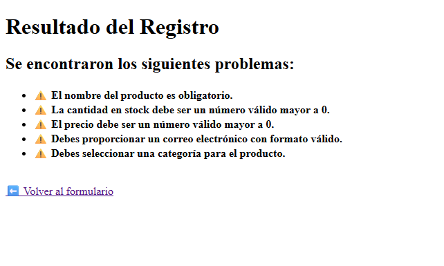
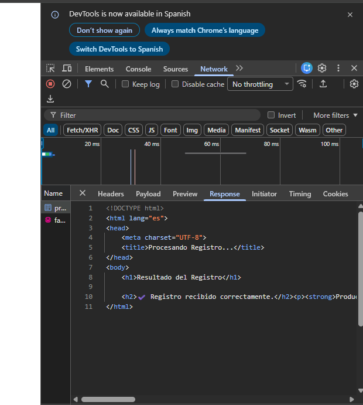
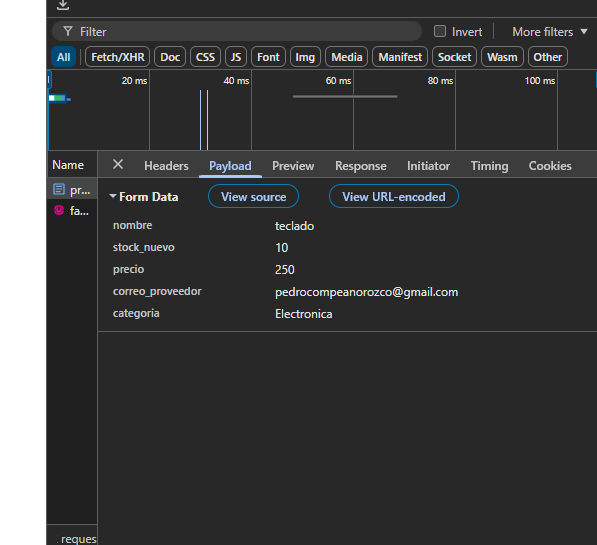

# 📝 Semana 02 - Formularios

---

## 🎯 Objetivo
Construir la segunda versión del proyecto integrador, incorporando un formulario HTML para que el usuario envíe datos y que PHP los reciba, los valide y muestre un resultado correspondiente.

## 🌐 Aplicación web
Mi proyecto es un **sistema de inventario**. Sirve para llevar el control de los productos que entran al almacén, gestionar las cantidades disponibles y registrar el valor de los artículos y sus proveedores.

## 📝 Formulario HTML
Es una interfaz visual compuesta por campos de texto, números, selectores y botones que sirve para que el usuario escriba información y pueda enviarla al servidor para ser procesada.

## 🗂️ Campos utilizados
Los campos que integré para el registro de productos son:
* 👤 **Texto:** `nombre` (Nombre del producto).
* 🔢 **Numérico:** `stock_nuevo` (Cantidad de piezas que ingresan).
* 💲 **Numérico adicional:** `precio` (Costo del producto).
* 📧 **Correo:** `correo_proveedor` (Contacto de quien surte el producto).
* 🔘 **Selección:** `categoria` (Tipo o departamento del producto).

---

## 📤 GET
**1. ¿Qué significa utilizar el método GET?**
Significa enviar los datos del formulario directamente a través de la dirección (URL) de la página web.

**2. ¿Dónde puedes observar los datos enviados?**
En la barra de direcciones del navegador web, justo después del signo de interrogación `?`.

**3. ¿Qué ocurre si modificas un dato directamente en la URL?**
El servidor procesa el nuevo dato que modificaste manualmente, lo cual puede ser inseguro si el sistema no tiene validaciones.

**4. ¿Qué variable de PHP utilizaste para recibir los datos?**
Se utiliza la variable superglobal `$_GET`.

**5. ¿Qué ventajas o limitaciones observaste?**
* **Ventaja:** Es fácil de usar y permite compartir el enlace (como en un buscador).
* **Limitación:** No sirve para enviar contraseñas o datos muy largos porque todo queda a la vista del usuario.

---

## 📥 POST
**1. ¿Qué significa utilizar el método POST?**
Significa enviar los datos de forma oculta en el cuerpo de la petición HTTP, sin que se vean reflejados en la URL.

**2. ¿Los datos aparecen de la misma forma en la URL?**
No, la URL se mantiene completamente limpia.

**3. ¿Qué variable de PHP utilizaste para recibirlos?**
Se utiliza la variable superglobal `$_POST`.

**4. ¿Qué diferencia observaste entre GET y POST?**
Que POST es invisible para el usuario y GET muestra absolutamente todos los valores arriba en el navegador.

**5. ¿Cuándo considerarías conveniente utilizar cada método?**
* **GET:** Para un buscador, filtros de una tienda o consultar información pública.
* **POST:** Para iniciar sesión, registrar usuarios, guardar productos o enviar información sensible.

---

## ✅ Validaciones
**1. ¿Qué es una validación?**
Es el proceso de revisar que la información que escribió el usuario cumpla con ciertas reglas y formatos antes de aceptarla y procesarla.

**2. ¿Por qué es necesario validar los datos?**
Para evitar que el usuario introduzca letras donde van números, deje campos obligatorios en blanco o intente romper el sistema con datos falsos.

**3. ¿Qué validaciones implementaste?**
* Que los campos no estén vacíos.
* Que el `stock` y el `precio` sean valores numéricos y mayores a cero.
* Que el `correo` tenga un formato de email válido (con arroba y dominio).

**4. ¿Qué ocurrió cuando introdujiste información incorrecta?**
La página detuvo el proceso y me regresó una lista con alertas visuales indicando los errores.

**5. ¿Qué ocurrió cuando introdujiste información correcta?**
El sistema procesó los datos, mostró un mensaje de éxito y generó un resumen del producto registrado.

---

## 🛠️ Herramientas de desarrollador
**1. ¿Qué método HTTP utilizó el formulario?**
Utilizó el método `POST`.

**2. ¿Qué información puedes observar en la solicitud?**
El código de estado de la respuesta (`200 OK`) y los datos exactos que se mandaron en la sección de *Payload*.

**3. ¿Qué diferencia encontraste entre una solicitud GET y una POST en la herramienta?**
En GET, los datos viajan en los parámetros de la URL (*Query String Parameters*), mientras que en POST viajan encapsulados en el *Payload* (Carga útil).

**4. ¿Qué recibe el servidor?**
Recibe un arreglo con las variables y los valores que capturó el usuario en los inputs.

**5. ¿Qué devuelve finalmente el servidor al navegador?**
Devuelve un documento con código HTML ya estructurado para mostrar los resultados en pantalla.

---

## 🔬 Experimento GET vs POST
Al realizar las pruebas, noté que al usar `GET`, la URL se llena con los datos del formulario, lo cual se ve poco estético para registrar un producto. Con `POST`, el envío es transparente y la dirección de la página no cambia para nada, dando un aspecto mucho más profesional y seguro.

---

## 🧪 Pruebas realizadas
1. **Formulario vacío:** Mandé el formulario sin llenar para comprobar que se activaran todas las alertas.
2. **Correo incorrecto:** Escribí un correo sin arroba para ver si el filtro de PHP lo detectaba.
3. **Números inválidos:** Introduje precios y stock con valores negativos o en cero.
4. **Campos adicionales:** Agregué el campo de precio y comprobé que PHP lo atrapara e imprimiera.
5. **Flujo ideal:** Llené todo correctamente para verificar el mensaje de confirmación final.

---

## 🐛 Problemas encontrados
Al momento de crear el archivo `procesar.php` y hacer los commits con Git, el archivo se creó en el directorio raíz de la carpeta `Practicas` en lugar de estar dentro de la carpeta `Semana02`. Git detectaba archivos sin rastrear fuera de lugar.

## 🔧 Soluciones aplicadas
Moví manualmente el archivo `procesar.php` hacia el interior de la carpeta `Semana02` usando el explorador de archivos. Posteriormente, volví a ejecutar los comandos `git add .` y `git commit` estando en el directorio correcto, con lo cual el repositorio quedó limpio y organizado.

---

## 🧠 Investigación
* 📝 **Formulario HTML:** Es un contenedor visual que agrupa controles para pedirle datos al usuario.
* ✍️ **input:** Es el cuadro o control interactivo donde el usuario escribe o selecciona la información.
* 🏷️ **name:** Es el atributo esencial que identifica a la variable para que el servidor (PHP) sepa cómo llamarla.
* 🎯 **action:** Es el atributo que indica la ruta o archivo PHP hacia donde van a viajar los datos al dar clic en enviar.
* 🚀 **method:** Define la forma o protocolo en la que viajan los datos (GET o POST).
* 📥 **$_GET y $_POST:** Son variables superglobales de PHP que actúan como "cajas" para recibir lo que mandó el formulario.
* ✅ **Validación:** Es el proceso de comprobar que los datos no estén vacíos ni contengan información basura o peligrosa.
* ⚠️ **Mensaje de error y confirmación:** Son las respuestas visuales para que el usuario entienda si su acción falló o fue exitosa.

---

## 🔄 Recorrido de los datos
1. **¿Dónde captura información el usuario?** En los controles (`inputs`) del formulario HTML.
2. **¿Qué elemento HTML permite realizar la captura?** La etiqueta principal `<form>`.
3. **¿Qué sucede cuando presiona el botón de envío?** El navegador empaqueta los datos ingresados y busca el archivo destino definido en el `action`.
4. **¿Qué protocolo transporta la solicitud?** El protocolo HTTP.
5. **¿Dónde recibe PHP la información?** A través de las variables superglobales (`$_POST` o `$_GET`).
6. **¿Qué diferencia existe entre $_GET y $_POST?** `GET` expone los datos en la URL; `POST` los oculta en el cuerpo de la petición.
7. **¿Por qué debemos validar la información?** Para garantizar la integridad de los datos y evitar errores o vulnerabilidades en el sistema.
8. **¿Qué ocurre cuando los datos son incorrectos?** PHP interrumpe el flujo normal y genera código HTML con alertas de error.
9. **¿Qué ocurre cuando los datos son correctos?** PHP procesa los datos con éxito y genera código HTML confirmando el registro.
10. **¿Qué recibe finalmente el navegador?** Un documento HTML procesado y estático con el resultado final para mostrárselo al usuario.

---

## 💡 Reflexión final
Durante esta práctica comprendí que el HTML es únicamente la "cara" o diseño de la aplicación y por sí solo no procesa nada. PHP actúa como el cerebro en el servidor, recibiendo todo lo que el usuario envía por detrás, evaluándolo mediante validaciones y decidiendo qué resultado devolver. Aprendí que nunca se debe confiar ciegamente en lo que ingresa el usuario, y que validar los datos y enviar mensajes claros de error es fundamental para crear un sistema robusto.

---

## 📸 Evidencias de las prácticas

### 1. Mensajes de error en validaciones

### 2. Mensaje de confirmación exitosa

### 3. Herramientas de desarrollador (Network - Response)

### 4. Herramientas de desarrollador (Network - Payload)
