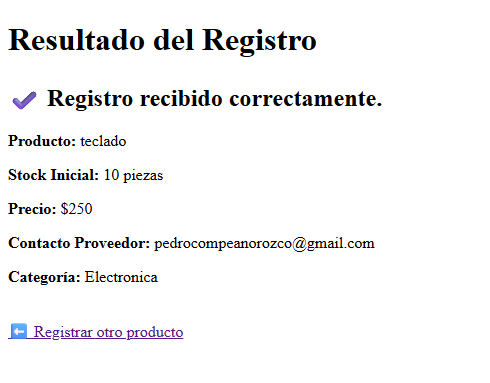
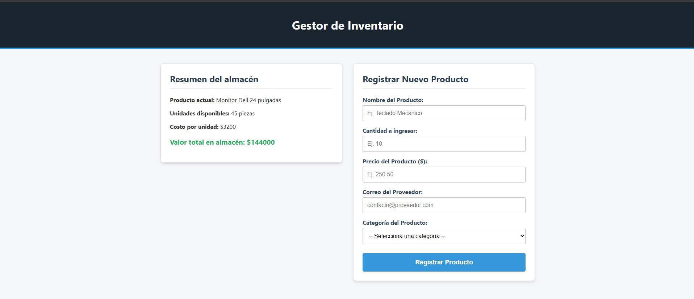
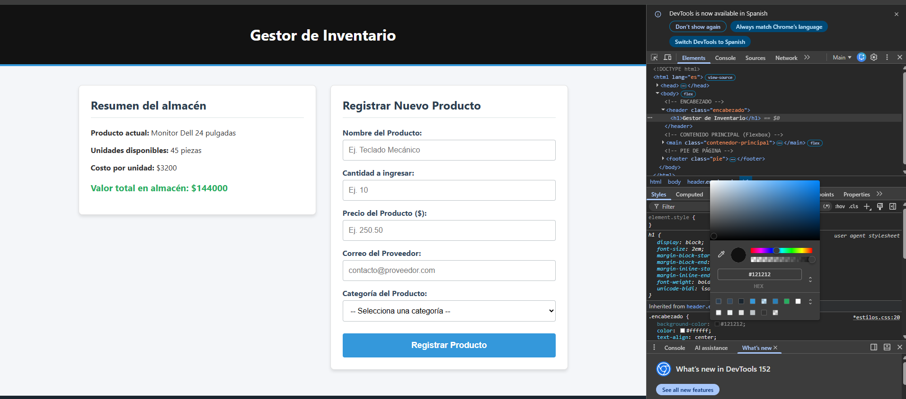
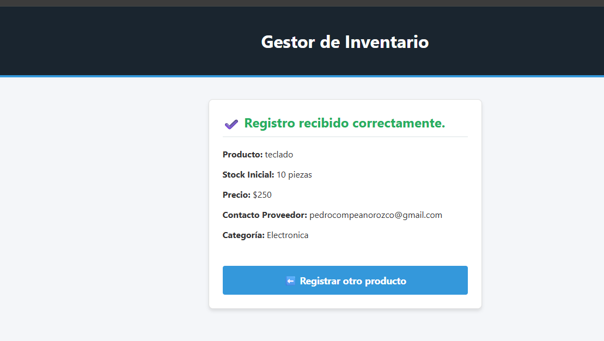

# 🎨 Semana 03 - CSS

---

## 🎯 Objetivo
Construir la tercera versión funcional del proyecto integrador, incorporando CSS para transformar la interfaz desarrollada durante las semanas anteriores en una aplicación web organizada, clara y visualmente atractiva.

## 🌐 Aplicación web
Mi proyecto es un **Gestor de Inventario**. Anteriormente solo funcionaba para procesar datos, pero ahora cuenta con una interfaz gráfica moderna, dividida en contenedores, con colores corporativos y una estructura clara para el usuario.

## 📄 HTML utilizado
Se actualizó el HTML para incluir etiquetas semánticas (`<header>`, `<main>`, `<footer>`, `<section>`) y se agregaron atributos `class` para poder enlazar cada bloque de código con los estilos de CSS.

## 🎨 Hoja de estilos
Se creó un archivo externo llamado `estilos.css`. Separar el HTML del CSS es una gran ventaja porque mantiene el código limpio, facilita encontrar errores y permite aplicar el mismo diseño a múltiples páginas (como `index.php` y `procesar.php`) con una sola línea de código.

## 🎯 Selectores CSS
* **Selector por elemento:** Lo usé en etiquetas como `body` o `input` para dar estilos generales.
* **Selector por clase:** Fue el que más utilicé (ej. `.caja`, `.encabezado`). Sirve para aplicar un diseño específico a un grupo de elementos sin afectar a los demás.
* **Diferencia entre clase e id:** La clase (`.`) se puede repetir en muchos elementos de la página, mientras que el `id` (`#`) es único para un solo elemento.

## 📦 Modelo de caja
En CSS, cada elemento es una caja cuadrada.
* **Margin:** Es el espacio *hacia afuera* de la caja (separa la caja de otros elementos).
* **Padding:** Es el espacio *hacia adentro* de la caja (separa el borde del contenido/texto).
* **Border:** Es la línea que dibuja el límite de la caja.

## ↔️ Flexbox
Utilicé Flexbox en la clase `.contenedor-principal` con `display: flex;`. Esto me permitió tomar las dos cajas (el resumen y el formulario) y ponerlas una al lado de la otra de forma alineada, en lugar de que salieran amontonadas hacia abajo.

## 📱 Diseño adaptable
El diseño adaptable es hacer que la página se vea bien tanto en computadoras como en celulares. La regla `@media` sirve para detectar el tamaño de la pantalla y cambiar el CSS si la ventana se hace pequeña.

---

## 🔬 Experimentos realizados

**Experimento 1 — Cambiar la apariencia:**
Cambié el color de fondo del encabezado a un azul oscuro (`#1a252f`) y agregué márgenes internos (`padding`). La página dejó de verse como un documento de Word y tomó forma de sistema profesional.

**Experimento 2 — Romper el diseño:**
* **Problema:** Borré intencionalmente un punto y coma (`;`) en la regla de `padding` de mi clase `.caja`.
* **Resultado:** Todo el bloque de código CSS debajo de ese error dejó de funcionar y la caja perdió sus bordes y fondo.
* **Solución:** Volví a poner el `;` y la página regresó a la normalidad. Aprendí que un solo error de sintaxis rompe el estilo.

**Experimento 3 — Cambiar una clase:**
Cambié el nombre de `<section class="caja">` a `<section class="contenedor">` en el HTML, pero dejé `.caja` en el CSS. El estilo desapareció completamente porque el HTML y el CSS perdieron su conexión.

**Experimento 4 — Herramientas de desarrollador:**
Utilicé la tecla `F12` para abrir las herramientas. Pude ver el modelo de caja de mi formulario coloreado (margin en naranja, padding en verde). Cambié un color directamente ahí; el cambio se vio al instante, pero desapareció al recargar la página. Es muy útil para hacer pruebas rápidas.

---

## 🧠 Investigación

1. **¿Qué es CSS?** Es un lenguaje de diseño usado para controlar cómo se ven los elementos en una página web.
2. **¿Para qué sirve?** Para poner colores, cambiar tipografías, acomodar elementos y hacer la página atractiva.
3. **¿Qué es un selector?** Es la palabra o símbolo que usamos en CSS para "apuntar" a qué etiqueta de HTML le vamos a dar estilo.
4. **¿Qué es una clase?** Es un identificador que se le pone a varios elementos HTML para darles el mismo diseño a todos juntos.
5. **¿Qué es un id?** Es un identificador único que sirve para darle estilo a un solo elemento específico de la página.
6. **¿Qué es el modelo de caja?** Es la regla de CSS que dice que todo elemento es un rectángulo compuesto por contenido, padding, borde y margen.
7. **¿Qué hace margin?** Crea espacio vacío alrededor de la caja, empujando a los vecinos lejos.
8. **¿Qué hace padding?** Crea espacio vacío adentro de la caja, empujando el texto lejos del borde.
9. **¿Qué hace border?** Dibuja una línea alrededor del padding y el contenido.
10. **¿Qué es Flexbox?** Es una herramienta de CSS para alinear y distribuir cajas de manera flexible en filas o columnas.
11. **¿Qué hace display: flex?** Activa el poder de Flexbox en un contenedor.
12. **¿Qué hace justify-content?** Alinea los elementos de forma horizontal (ej. centrarlos o separarlos).
13. **¿Qué hace align-items?** Alinea los elementos de forma vertical.
14. **¿Qué es diseño adaptable?** Son técnicas para que la web se ajuste y se vea bien en cualquier tamaño de pantalla.
15. **¿Qué es @media?** Es una regla de CSS que pregunta el tamaño de la pantalla y aplica estilos solo si se cumple la condición.

---

## 🌐 Relación entre HTML, CSS y PHP

1. **¿Qué función cumple HTML?** Pone la estructura y el contenido (los cimientos y los ladrillos).
2. **¿Qué función cumple CSS?** Pone la presentación y el diseño (la pintura y decoración).
3. **¿Qué función cumple PHP?** Procesa la lógica y los datos en el servidor (la electricidad y tuberías).
4. **¿Quién interpreta CSS?** El navegador web (Chrome, Edge, Safari).
5. **¿Por qué CSS no reemplaza a HTML?** Porque CSS no puede crear contenido ni inputs, solo puede maquillarlos.
6. **¿Por qué CSS no reemplaza a PHP?** Porque CSS no sabe hacer cálculos, ni guardar datos, ni validar información.
7. **¿Qué ocurre cuando el navegador carga una página?** Lee el HTML de arriba a abajo, detecta la etiqueta de CSS, descarga los estilos y los pinta en pantalla.
8. **¿Cómo se aplica una hoja CSS externa?** Usando la etiqueta `<link rel="stylesheet" href="estilos.css">` en el `<head>`.
9. **¿Qué ocurre si el archivo CSS no existe?** La página carga, pero se ve en blanco y negro, como texto plano sin formato.
10. **¿Qué ocurre si el nombre de la clase HTML no coincide con el CSS?** El elemento se queda sin diseño, ya que el CSS no logra encontrar a quién aplicarle las reglas.

---

## 💡 Reflexión final
En esta práctica aprendí que construir una página web es como hacer una casa. HTML son los ladrillos, PHP es el cableado eléctrico que hace que las cosas funcionen, y CSS es la pintura y los muebles. Separar el diseño en un archivo `estilos.css` hace que sea mucho más fácil administrar el proyecto y darle un aspecto profesional a lo que antes era solo una pantalla de texto plano.

## 📸 Evidencias de las prácticas

### 1. Formulario antes de aplicar CSS (Semana 02)

### 2. Formulario después de aplicar CSS (Estructura final)

### 3. Modelo de Caja y Flexbox (Herramientas F12)

### 4. Resultado del procesamiento estilizado (procesar.php)
